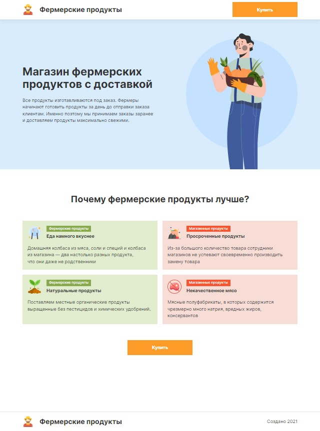
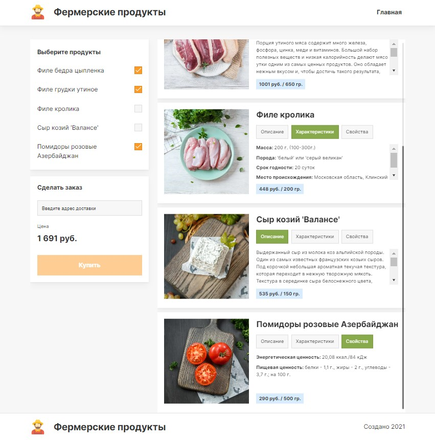

# Интернет-магазин "Фермерские продукты"

> Ссылка на сайт https://comfy-kleicha-b2ca19.netlify.app/

## Описание

Личный учебный проект по курсу "Вёрстка React-компонентов" от HTML Academy.

## Цели проекта

- закрепить имеющиеся знания по библиотеке React
- изучить библиотеку Styled-components
- освоить самостоятельную сборку проектов с помощью Webpack
- научиться выкладывать приложение на Netlify

## Функциональность

- раскрывает преимущества покупки фермерских продуктов
- позволяет узнать подробную информацию о товарах
- позволяет заказывать выбранные продукты с доставкой на дом (заказ и доставка не настоящие, так как проект учебный)

## Скриншоты приложения

### Главная страница

  

### Страница заказа

  

